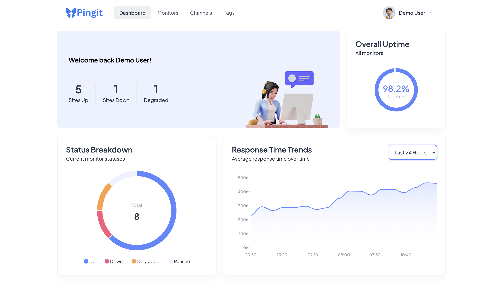
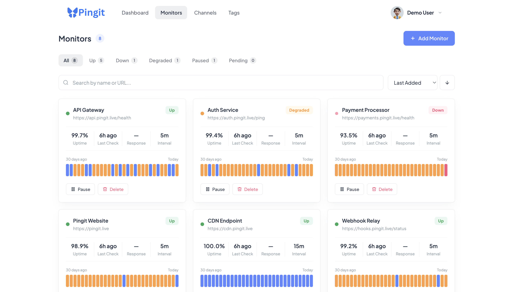
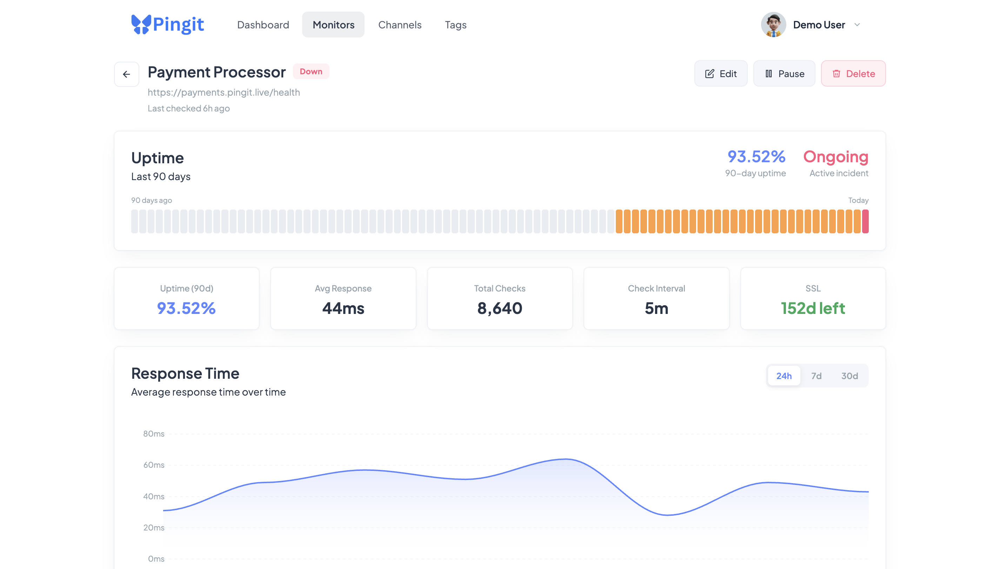

# Pingit API

A full-stack uptime monitoring system built with Laravel 13.x and PHP 8.4+

Pingit monitors your URLs, detects outages, tracks performance, and sends notifications the moment something goes wrong.

---

## Live Demo

**Frontend:** [https://www.pingit.live](https://www.pingit.live)

**API Base URL:** `https://api.pingit.live`

**Frontend Repository:** [https://github.com/joecode77/pingit-app](https://github.com/joecode77/pingit-app)

**Demo credentials:**

- Email: `demo@pingit.live`
- Password: `password`

> **Note:** The demo account is pre-loaded with real, well-known sites (Google, GitHub, Cloudflare, and others) so you can immediately explore live uptime data, response time charts, and incident history. To monitor your own sites, register a new account and add your own URLs.

---

## Table of Contents

- [Screenshots](#screenshots)
- [Features](#features)
- [Tech Stack](#tech-stack)
- [Requirements](#requirements)
- [Installation](#installation)
- [Running the Application](#running-the-application)
- [Running Tests](#running-tests)
- [API Documentation](#api-documentation)
- [Integrations](#integrations)
- [Architecture](#architecture)
- [Design Decisions](#design-decisions)

---

## Screenshots

### Dashboard



### Monitors



### Monitor Detail



---

## Features

- **URL Monitoring** — Register URLs and check them at configurable intervals (1–60 minutes)
- **Status Detection** — Tracks `pending`, `up`, `degraded`, and `down` states
- **Failure Threshold** — Only marks a site as down after N consecutive failures
- **Degraded Detection** — Flags sites that respond slowly but haven't gone down
- **Incident Grouping** — Consecutive failures grouped into incidents with duration tracking
- **Email Notifications** — Alerts on down, recovery, and degraded events via Brevo
- **Notification Cooldowns** — Prevents email spam during flapping sites
- **Webhook Support** — Push status change events to external systems (Slack, PagerDuty, etc.)
- **Multiple Notification Channels** — Add multiple email addresses or webhooks per monitor
- **SSL Certificate Monitoring** — Tracks expiry and alerts before certificates expire
- **DNS Resolution Tracking** — Measures DNS resolution time separately from response time
- **Response Time Trends** — Average, min, and max response times over 24h, 7d, or 30d
- **Daily Stats** — Aggregated daily uptime and response time metrics per monitor (up to 90 days)
- **Uptime Percentage** — Calculated per monitor from check history
- **Dashboard Summary** — Overall stats across all monitors
- **Tags** — Organise monitors into groups
- **Pause/Resume** — Temporarily stop monitoring without losing history
- **Check History** — Full paginated history of every check with CSV export
- **Filter, Sort & Search** — Query monitors by status, tag, name, or URL
- **Authentication** — Token-based auth via Laravel Sanctum
- **API Documentation** — Interactive Swagger UI at `/api/documentation`

---

## Tech Stack

| Layer              | Technology           |
| ------------------ | -------------------- |
| Language           | PHP 8.4+             |
| Framework          | Laravel 13.x         |
| Database           | PostgreSQL           |
| Authentication     | Laravel Sanctum      |
| Queue Driver       | Database             |
| Mail (Development) | Mailtrap             |
| Mail (Production)  | Brevo                |
| Testing            | Pest                 |
| API Docs           | Swagger (l5-swagger) |

---

## Requirements

- PHP 8.4+
- Composer
- PostgreSQL
- A Mailtrap account (for development mail)

---

## Installation

### 1. Clone the repository

```bash
git clone https://github.com/joecode77/pingit-api.git
cd pingit-api
```

### 2. Install dependencies

```bash
composer install
```

### 3. Copy the environment file

```bash
cp .env.example .env
```

### 4. Generate application key

```bash
php artisan key:generate
```

### 5. Configure the database

Create a PostgreSQL database named `pingit`, then update your `.env`:

```env
DB_CONNECTION=pgsql
DB_HOST=127.0.0.1
DB_PORT=5432
DB_DATABASE=pingit
DB_USERNAME=your_postgres_username
DB_PASSWORD=your_postgres_password
```

### 6. Configure mail (Mailtrap for development)

Sign up at [mailtrap.io](https://mailtrap.io) and copy your SMTP credentials into `.env`:

```env
MAIL_MAILER=smtp
MAIL_HOST=sandbox.smtp.mailtrap.io
MAIL_PORT=2525
MAIL_USERNAME=your_mailtrap_username
MAIL_PASSWORD=your_mailtrap_password
MAIL_FROM_ADDRESS=noreply@pingit.live
MAIL_FROM_NAME="Pingit"
```

### 7. Run migrations

```bash
php artisan migrate
```

### 8. Generate API documentation

```bash
php artisan l5-swagger:generate
```

### 9. Seed the database (optional)

To populate the application with a demo user and realistic monitor data:

```bash
php artisan db:seed
```

This creates a demo account pre-loaded with real, well-known sites (Google, GitHub, Cloudflare, Stripe, and others), 30 days of check history, incidents, tags, and notification channels so you can explore the full API without manually creating data.

**Demo credentials:**

- Email: `demo@pingit.live`
- Password: `password`

### 10. Run the frontend (optional)

To run the full stack locally, clone the frontend repository and follow the setup instructions included there:

[https://github.com/joecode77/pingit-app](https://github.com/joecode77/pingit-app)

---

## Running the Application

### Start the development server

```bash
php artisan serve
```

### Start the queue worker (required for URL checks)

```bash
php artisan queue:work
```

### Start the scheduler (required for dispatching checks)

```bash
php artisan schedule:run
```

> **Note:** All three processes must be running for the full monitoring system to work. In production, these would be managed by a process supervisor like Supervisor.

---

## Running Tests

The test suite uses Pest with an in-memory SQLite database so no database setup is required.

```bash
php artisan test
```

To run a specific test file:

```bash
php artisan test --filter=MonitorTest
```

### Test Structure

```
tests/
├── Feature/
│   ├── AuthTest.php                  # Registration, login, logout
│   ├── MonitorTest.php               # Monitor CRUD, history, incidents, tags
│   ├── CheckMonitorJobTest.php       # Background job and status transitions
│   ├── NotificationTest.php          # Email notification logic
│   └── NotificationChannelTest.php   # Webhook and channel management
└── Unit/
    └── CheckServiceTest.php          # Core business logic unit tests
```

---

## API Documentation

Interactive Swagger documentation is available at:

```
http://localhost:8000/api/documentation
```

Or on the live server:

```
https://api.pingit.live/api/documentation
```

### Authentication

All protected endpoints require a Bearer token in the `Authorization` header:

```
Authorization: Bearer {your_token}
```

Obtain a token by registering or logging in via the Auth endpoints.

### Endpoints Overview

| Method | Endpoint                                  | Description                   |
| ------ | ----------------------------------------- | ----------------------------- |
| POST   | `/api/auth/register`                      | Register a new user           |
| POST   | `/api/auth/login`                         | Login and receive token       |
| POST   | `/api/auth/logout`                        | Logout and revoke token       |
| GET    | `/api/monitors`                           | List all monitors             |
| POST   | `/api/monitors`                           | Create a monitor              |
| GET    | `/api/monitors/{id}`                      | Get a single monitor          |
| PUT    | `/api/monitors/{id}`                      | Update a monitor              |
| DELETE | `/api/monitors/{id}`                      | Delete a monitor              |
| POST   | `/api/monitors/{id}/pause`                | Pause a monitor               |
| POST   | `/api/monitors/{id}/resume`               | Resume a monitor              |
| GET    | `/api/monitors/{id}/history`              | Check history (paginated)     |
| GET    | `/api/monitors/{id}/history/export`       | Export history as CSV         |
| GET    | `/api/monitors/{id}/incidents`            | Incident history              |
| GET    | `/api/monitors/{id}/response-times`       | Response time trends          |
| GET    | `/api/monitors/{id}/daily-stats`          | Daily uptime & response stats |
| POST   | `/api/monitors/{id}/tags`                 | Attach a tag                  |
| DELETE | `/api/monitors/{id}/tags/{tagId}`         | Detach a tag                  |
| GET    | `/api/monitors/{id}/channels`             | List notification channels    |
| POST   | `/api/monitors/{id}/channels`             | Add notification channel      |
| DELETE | `/api/monitors/{id}/channels/{channelId}` | Delete notification channel   |
| GET    | `/api/dashboard`                          | Dashboard summary             |
| GET    | `/api/tags`                               | List tags                     |
| POST   | `/api/tags`                               | Create a tag                  |
| DELETE | `/api/tags/{id}`                          | Delete a tag                  |

---

## Integrations

### Webhooks

Webhooks allow you to push status change events from Pingit to external systems such as Slack, PagerDuty, or your own custom dashboard. When a monitor changes status, Pingit sends an HTTP `POST` request to your configured webhook URL with a JSON payload describing the event. This means your external systems are notified in real time without needing to poll the API.

To configure a webhook, add a notification channel of type `webhook` to any monitor via the `POST /api/monitors/{id}/channels` endpoint.

**Payload structure:**

```json
{
    "event": "monitor.down",
    "monitor": {
        "id": 1,
        "name": "My Website",
        "url": "https://example.com"
    },
    "triggered_at": "2026-05-17T10:00:00+00:00"
}
```

**Possible `event` values:**

| Event              | Trigger                                                      |
| ------------------ | ------------------------------------------------------------ |
| `monitor.down`     | Monitor has reached the failure threshold                    |
| `monitor.recovery` | Monitor has recovered after being down                       |
| `monitor.degraded` | Monitor is responding slowly beyond the configured threshold |

---

### AI Agent Integration

The webhook payload is not limited to human-facing tools like Slack. Because each event delivers a structured JSON payload the moment a status change occurs, it is a natural trigger for an AI agent.

Some examples of what an AI agent could do upon receiving a Pingit webhook event:

- **Automated investigation** — On receiving a `monitor.down` event, an agent could immediately query server logs, check related services, or run diagnostics and compile a report before a human even looks at the alert.
- **Intelligent incident reporting** — An agent could draft and post a detailed incident summary to a Slack channel or ticketing system, enriched with context beyond just the raw status change.
- **Smart paging decisions** — An agent could decide whether to escalate and page an on-call engineer based on the monitor's history, the time of day, or the severity of the outage.
- **Automated remediation** — An agent could trigger infrastructure actions such as restarting a service, scaling resources, or rolling back a deployment in response to a `monitor.down` event.

In short, the webhook system turns Pingit into an event source that any AI-powered workflow can subscribe to and act on in real time.

---

## Architecture

### Directory Structure

```
app/
├── Console/Commands/
│   └── DispatchMonitorChecks.php    # Scheduled command to dispatch check jobs
├── Http/
│   ├── Controllers/
│   │   ├── Auth/AuthController.php
│   │   ├── Monitor/MonitorController.php
│   │   ├── NotificationChannel/NotificationChannelController.php
│   │   ├── Tag/TagController.php
│   │   └── DashboardController.php
│   ├── Requests/                    # Form request validation classes
│   └── Resources/                   # API response transformation classes
├── Jobs/
│   └── CheckMonitorJob.php          # Queued job that performs each URL check
├── Mail/                            # Mailable classes for notifications
├── Models/                          # Eloquent models
└── Services/
    ├── AuthService.php
    ├── CheckService.php             # Core check logic and status transitions
    ├── DashboardService.php
    ├── MonitorService.php
    └── SslService.php               # SSL certificate inspection
```

### Request Lifecycle

```
Scheduler (every minute)
  → DispatchMonitorChecks command
    → Queries monitors due for checking
      → Dispatches CheckMonitorJob per monitor
        → Makes HTTP request
        → Measures DNS resolution time
        → Records check result
        → Updates monitor status
        → Opens/closes incidents
        → Checks SSL certificate
        → Sends notifications (email + webhooks)
```

---

## Design Decisions

### Why PostgreSQL?

PostgreSQL offers better support for JSON columns, more robust indexing, and is the preferred choice for production Laravel applications.

### Why Queues for URL Checking?

Each monitor check is dispatched as a queued job so checks run concurrently. A slow or failing check on one monitor does not block others. The `is_checking` flag prevents overlapping jobs for the same monitor.

### Why Per-Monitor `next_check_at`?

Instead of a fixed cron per interval, each monitor has its own `next_check_at` timestamp. The scheduler runs every minute and dispatches jobs for any monitor whose `next_check_at` is in the past. This allows truly independent intervals per monitor.

### Why Services Instead of Fat Controllers?

Controllers handle HTTP input/output only. All business logic lives in service classes making it testable in isolation and keeping controllers thin and readable.

### Why Pest over PHPUnit?

Pest provides a cleaner, more expressive syntax with less boilerplate. It is built on top of PHPUnit so nothing is lost — just cleaner tests.

### Why `Mail::fake()` in Tests?

No real emails are sent during tests. `Mail::fake()` intercepts all outgoing mail and allows assertions about what would have been sent, without any external service dependency.

### Why Soft Deletes on Monitors?

Deleting a monitor soft-deletes it so the check history is preserved in the database. This prevents data loss and allows potential future restoration.

### Why Notification Cooldowns?

Without cooldowns, a flapping site would generate many emails in a short period. The cooldown period (`check_interval × threshold` minutes) ensures notifications are meaningful and not excessive.
